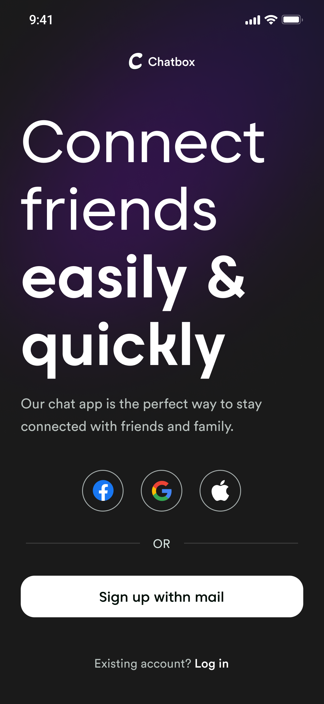
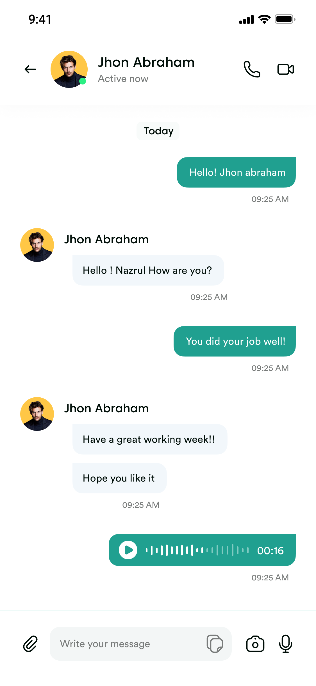

# ChatBox - Flutter and Firebase Chat App


ChatBox is a real-time chat application built using Flutter and Firebase that allows users to communicate with each other in a seamless and interactive manner. This app provides a user-friendly interface and supports instant messaging between multiple users.

## Features

- User authentication: Users can sign up and log in securely to access the chat functionalities.
- Real-time messaging: Users can send and receive messages in real-time, creating a smooth chat experience.
- Group chat: ChatBox supports group chat functionality, allowing users to create and join chat rooms.
- Image sharing: Users can share images within the chat rooms, making conversations more engaging.
- Push notifications: Users receive push notifications for new messages even when the app is in the background.

## Screenshots

 

## Installation

1. Clone the repository to your local machine using the following command:

```bash
git clone https://github.com/your-username/chatbox.git
```

2. Make sure you have Flutter and Dart installed on your development environment.

3. Install the required packages by running:

```bash
flutter pub get
```

4. Set up Firebase for the project and add your `google-services.json` file in the `android/app` directory for Android and `GoogleService-Info.plist` file in the `ios` directory for iOS.

5. Run the app on an emulator or physical device using the following command:

```bash
flutter run
```

## Configuration

To configure the app and Firebase services, you need to update the following files:

### Firebase configuration

- `android/app/google-services.json` (for Android)
- `ios/Runner/GoogleService-Info.plist` (for iOS)

### Firebase Authentication

Enable the necessary authentication methods (e.g., Email/Password, Google Sign-In) in the Firebase console.

### Firebase Firestore Database

Set up Firestore and create the required collections and documents for storing chat messages and user information.

## Contributing

We welcome contributions to improve ChatBox. To contribute, follow these steps:

1. Fork the repository.
2. Create a new branch.
3. Make your changes and commit them.
4. Push the changes to your forked repository.
5. Submit a pull request, describing the changes you made.

## Issues

If you encounter any bugs or have suggestions for improvements, please [open an issue](https://github.com/your-username/chatbox/issues) on GitHub.

## License

This project is licensed under the [MIT License](LICENSE).

---

Thank you for checking out ChatBox! We hope this app provides you with an excellent platform for seamless communication and collaboration. If you have any questions or need assistance, feel free to reach out to us.

Happy chatting! 😄📱
